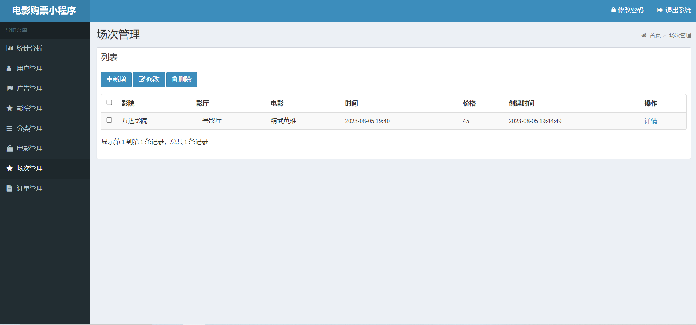

# 电影院购票小程序 

##（源代码+12000字文档+ppt）

## 项目简介

电影院购票小程序是一套仿照市面上已有的购票小程序开发的一套入门级微信小程序。 
本系统分为小程序端和管理端，小程序端主要是为用户提供电影查询，选座，下单，购票的功能。管理端主要是为管理员提供管理电影等其他功能。 
电影院购票小程序比较贴合学生平时的生活需求，题目经典不失新颖，且界面美观大方，非常适合作为设计项目或者学习使用。 
视频介绍：<a href="https://www.bilibili.com/video/BV18X4y1L79n/?spm_id_from=333.999.0.0&vd_source=e6eb98771fefe4bc68298183ff572b90" target="_blank">点击查看B站视频介绍</a>

## 功能介绍

## 技术学习

如果你在安装过程中，或对项目有疑问，可以关注本人公众号获取本人联系方式进行咨询。 
公众号内还有更多项目供你选择。 

## 技术服务

## 技术栈

| 工具及技术             | 版本    |
| ---------------------- | ------- |
| idea                   |         |
| JDK                    | 1.8     |
| SpringBoot             | 2.2.1   |
| MyBatis                | 1.3.2   |
| Jquery                 |         |
| layui                  |         |
| MySQL                  | 5.7     |
| 微信开发者工具         |         |

## 安装教程

1.安装jdk1.8。 
2.安装MySQL5.7。 
3.在mysql中创建数据库movie，导入后台代码中的movie.sql。 
4.在idea中导入后端项目movie-java。 
5.在微信开发者工具中导入微信小程序项目movie-wx。 
6.启动后端程序默认启动端口是10000，可自行修改。 

## 系统图片

#### 1.首页
 
#### 2.电影分类
 
#### 3.查看电影详情
 
#### 4.选座购票
 
#### 5.查看订单
 
#### 6.我的
 
#### 7.管理端登录页
 
#### 8.电影场次管理
 

